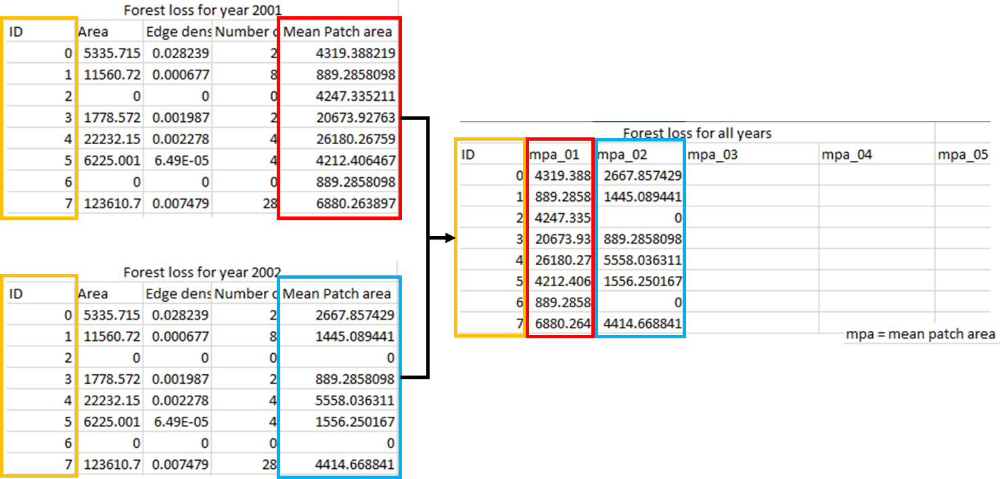

# Technical Background

A github repository has been created under [https://github.com/LandscapeGeoinformatics/LandscapeMetrics_and_TrendCalc](https://github.com/LandscapeGeoinformatics/LandscapeMetrics_and_TrendCalc) as a part of scientific research published in Scientific Reports [@Montibeller2020].

The software and tools used were R Statistical Language, Python, GDAL, QGIS and ArcMap 10.6. 
In order to develop the analysis, we used two products of the Global Forest Change dataset (Hansen et al. 2013) freely available at http://earthenginepartners.appspot.com/science-2013-global-forest in Geotiff format. 

## Case study

1) Tree canopy cover for year 2000 ver. 1.5 - the percentage (0 - 100%) of tree cover for each Landsat pixel (30mx30m) in the year 2000 

2) Year of gross forest cover loss event ver. 1.5 provides the information of the year (1-17) of the forest loss during the period of 2000 to 2017.

It is important to note that forest loss is considered by the authors as "a stand-replacement disturbance or the complete removal of tree cover canopy at the Landsat pixel scale" (Hansen et al. 2013). Each Landsat pixel that represents forest loss is assigned with a number that represents the year. For example, pixels with value 1 represent forest loss in the year 2001 whereas pixels with value 17 represent forest loss in the year 2017. 
Both datasets (forest cover and forest loss) are available in tiles of 10x10 degree. We used 12 tiles to create mosaics covering the entire the BLA. The mosaics were created using the ‘merge function’ of the ‘raster’ library in R. You can find the scripts with comments in this repository (https://github.com/LandscapeGeoinformatics/LandscapeMetrics_and_TrendCalc/blob/master/mosaic_bla.R). After that, we clipped the forest loss and forest cover mosaics using the limits of the Brazilian Legal Amazon available at https://maps.csr.ufmg.br/ on “Recursos naturais” –> “Vegetação” –> “Limite da Amazônia Legal”. The ‘Extract by Mask’ tool in ArcMap 10.6 was used for clipping the mosaics. 

As the original coordinate system of both datasets is WGS 84, we projected each mosaic to a cylindrical equal area projection (EPSG: 54034). These conversions were necessary because landscape metrics require projected data in order to calculate results in distances and areas. The datasets were projected using the ‘Project raster’ tool in ArcMap 10.6. 

We reclassified the “Tree canopy cover for year 2000” data in order to create a forest cover mask for the year 2000. We used the threshold of >30% of tree cover to define forest areas. Every pixel >=30% was classified as class 2 (random value choice), while the other pixels (<30%) were classified as no-data (NA). Using the forest cover mask, we extracted only pixels from the “Year of gross forest cover loss event” dataset that were within the mask. 

We created annual single forest loss files (one raster file for each year in GeoTiff format) by using the ‘Extract by Attribute’ function in ArcMap 10.6 and retaining the cylindrical equal area projection and the same dimensions (111475 columns and 84848 rows), which is important for the next step. 

We used the annual single files of forest loss to create annual forest cover files:

```
FC2000 – FL2001 = FC2001	
FC2001 – FL2002 = FC2002

...

FC2016 – FL2017 = FC2017
```

where FC is the forest cover and FL is the forest loss of the indicated year. These subtraction processes were executed via a python script using GDAL. 

The data results of the before mentioned steps were as following:

1) One raster file with all forest loss across all years (pixels values ranging from 1-17).

2) Eighteen raster files of annual forest cover (from 2000 to 2017).

3) Seventeen raster files of annual forest loss (one file for each year; 2001, 2002…2017). 

We used and modified the script available at [https://github.com/LandscapeGeoinformatics/lc_metrics_resources](https://github.com/LandscapeGeoinformatics/lc_metrics_resources) to calculate landscape metrics in the entire BLA. We calculated landscape metrics for annual forest cover and the metric for the all forest loss (since this metric required the forest loss information in one single raster). In the same script repository, you can find some working examples with a sample area from the Amazon region. We also used the script to calculate landscape metrics fir the annual forest loss raster files. 

Note that there are several options of landscape metrics, but you should select only the ones that are suitable for your analysis in the ‘desired_funcs’ list. In this manner, only the desired metrics will be calculated. As the Brazilian Amazon covers an area bigger than 5×106 km2, we recommend to use a computer with a RAM memory 4 times bigger than the uncompressed Geotiff data file. The results are saved into a .csv files where one of the columns provides the raster’s classes (pixel value or values) and the remaining columns will be named after the calculated metrics. 

In order to perform the trend analysis using the landscape metrics values, a \~10 km × \~10 km fishnet (grid) covering the BLA was created using the ‘Create Fishnet’ tool in ArcMap 10.6 and saved as shp-file. We calculated landscape metrics for each fishnet tile separately using each one of the eighteen raster files of annual forest cover and each one of the seventeen raster files of annual forest loss. We created separate shp-files for every fishnet tile by using Python fiona library. Each tile had an unique ID. We clipped each tile from the input rasters by using GDAL and calculated the landscape metrics on these clipped tiles and stored the results associated with each tile together with the original ID of the tile as separate csv-files (metrics.csv). Finally, all tiles’ statistics were joined to the original fishnet attribute table by using the tile ID-s (see figure below). The script for clipping, saving and calculating the landscape metrics by tiles for a list of rasters here (link). 

```{r, echo = FALSE, out.width="100%", fig.cap="Examplary metrics summary throughout the workflow"}

```

The metrics.csv files with year, ID and landscape metric values for each fishnet tile were the input for performing Mann-Kendall trend analysis. A R script used for to calculating the Mann Kendall trend and its significance can be found here (https://github.com/LandscapeGeoinformatics/LandscapeMetrics_and_TrendCalc/blob/master/mann_kendall_test.R). 

# Visualization

For visualizing my research results I will use temporal animations to show spatial-temporal changes of the forest loss areas from southern parts of Amazon region to central-northern areas. These animations will be mainly used to publicizing the research.
Standard maps will also be use in order to illustrate the results in scientific papers.

# Reproducibility

My research will use mainly open source data as well as processing tools. 

The forest data by @hansen2013high that we will use is open-access and it is available at [https://earthenginepartners.appspot.com/science-2013-global-forest/](https://earthenginepartners.appspot.com/science-2013-global-forest/). The dataset is licensed under a Creative Commons Attribution 4.0 International License. 

Scripts and software: Scripts that will be used for data processing will be fully available at a repository on GitHub ([https://github.com/brunomontibeller/agile_2019](https://github.com/brunomontibeller/agile_2019)) under an open license. All the parameters as well as all the libraries used (and that are freely available) will be also accessible in the same github repository. The list of open sources software and the tools used will also be documented in detail in the GitHub repository. 

Data: The data processed and created in the research will be available upon request to the first author of the paper. 

# Science communication

Audience:

Researchers: Eugenio Arima, Peter Richards, Michelle Kalamandeen and Isabel M. D. Rosa

Institutions: Forest management agencies, inspecting agencies etc. 

What did you do?

We evaluate the forest dynamics (forest loss and forest fragmentation) in the Brazilian Legal Amazon using landscape metrics, hotspot and temporal trend analysis. For the analysis we used annual forest loss and forest cove data from 2000 to 2017. The dataset were developed by Hansen et al (2013) and are available at https://earthenginepartners.appspot.com/science-2013-global-forest/download_v1.5.html. 

Why did you do it?

We identified a lack of spatial analysis that combined forest loss and forest cover in the Brazilian Legal Amazon. Most of the studies have only focused on the changes of the forest loss process overtime, excluding the effect of these changes in the fragmentation of the remaining forest cover. 

What happened?

We found that even though the forest loss decreased overtime, the forest cover fragmentation increased. The hypothesis is that the spatial change of the forest loss process to inner areas with forest cover in the amazon is the main reason for the increase in the fragmentation.
What do the results mean in theory? 
They mean that the current anti-deforestation initiatives are not robust to face the new pattern of forest dynamics in the amazon region. Additionally, the spatial change of forest loss to the western areas can increase GHG emission once these areas present more carbon stock as biomass.

# References {-}
